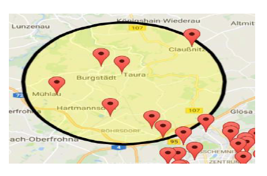
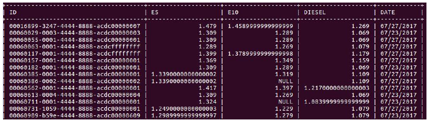
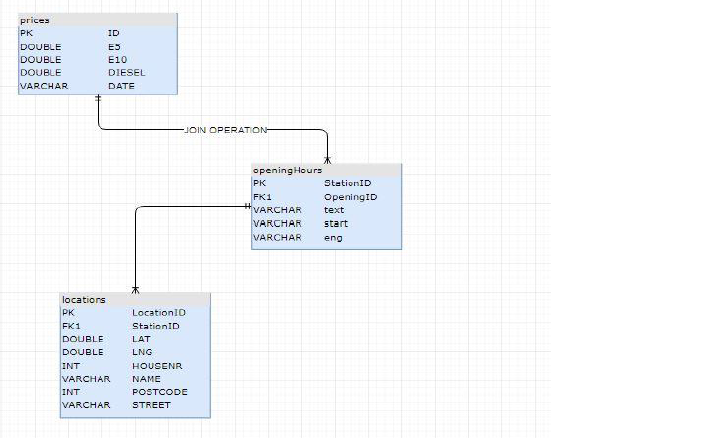
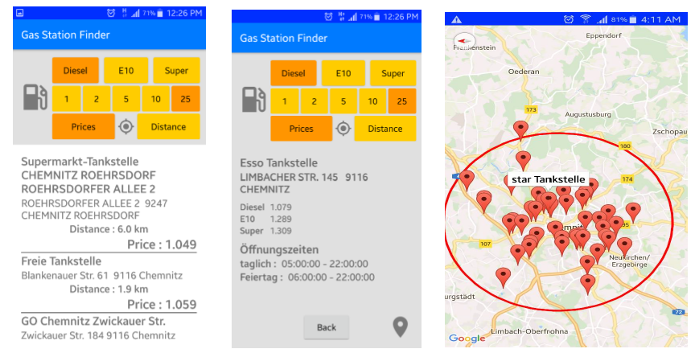

README

This README would normally document whatever steps are necessary to get your application up and running.
What is this repository for?

    Quick summary The repository is for TankstelleAPP
    Version No version
    Learn Markdown

How do I set up?

    Summary of set up You have to download npm and nodejs last version from the online sources. After downloading, open a command line and navigate to the project folder. First of all, type "npm install" and then "npm start".
    Configuration Test the npm with the following command in windows command line "npm --version" Test nodejs version with the following command "node --version"
    Dependencies npm, nodejs and node modules
    Database configuration You need to install mysql database in your local or remote path. After creating mysql server, please create a user with the following command named tankkoenig mysql> "CREATE USER 'tankkoenig'@'localhost' IDENTIFIED BY 'password'" mysql> "GRANT ALL PRIVILEGES ON . TO 'tankkoenig'@'localhost' WITH GRANT OPTION"; mysql> "CREATE USER 'tankkoenig'@'%' IDENTIFIED BY 'password'"; mysql> "GRANT ALL PRIVILEGES ON . TO 'tankkoenig'@'%' WITH GRANT OPTION;"
    How to run tests No test yet
    Deployment instructions
	
Brief Overview on the Project

	This is a project that uses an API the so-called tankerkönig API to provide gasoline prices regarding oil station to the end user and drivers.
	
	
	
	
	
	

Contribution guidelines

    Writing tests
    Code review
    Other guidelines
